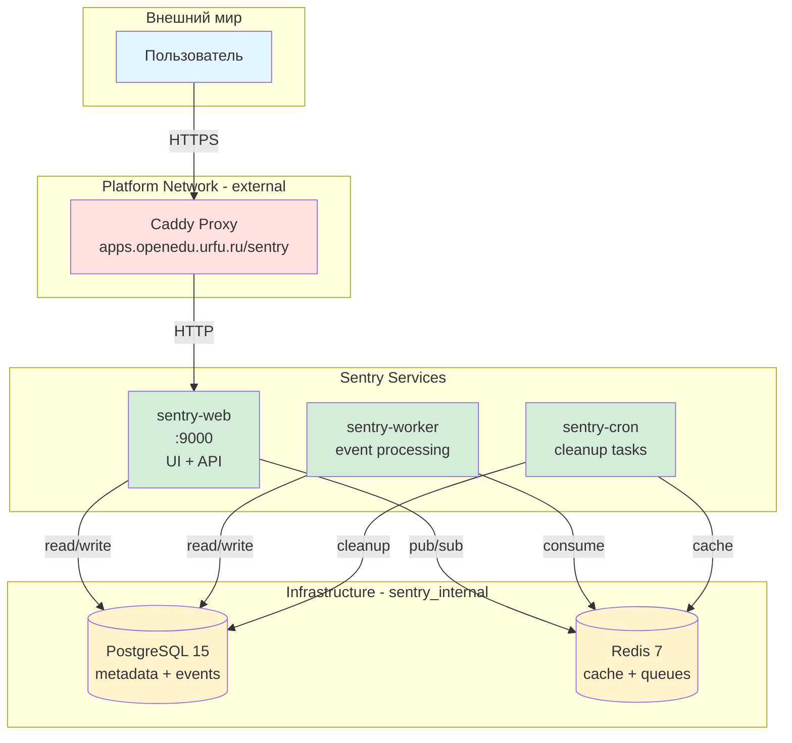
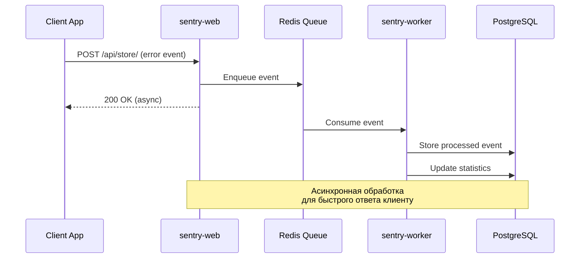
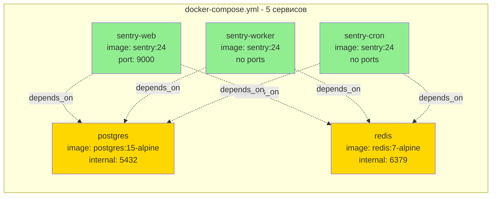
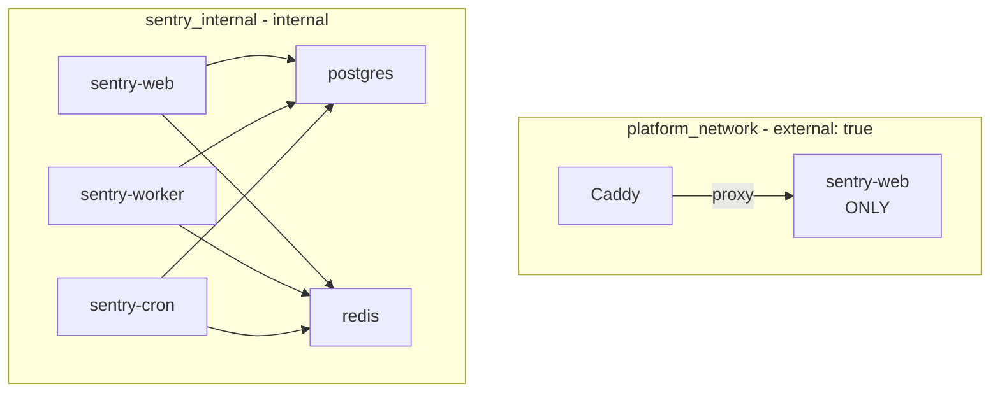
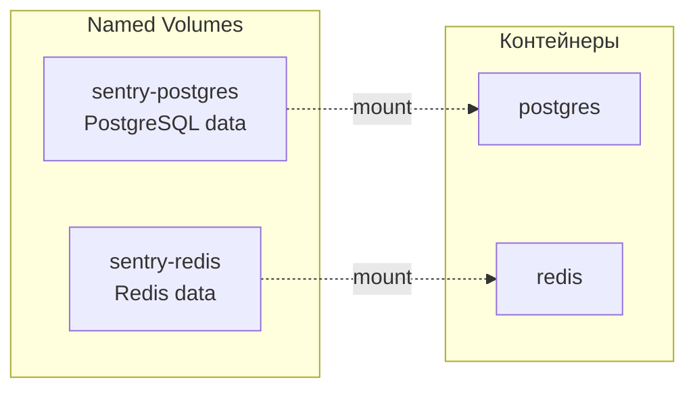
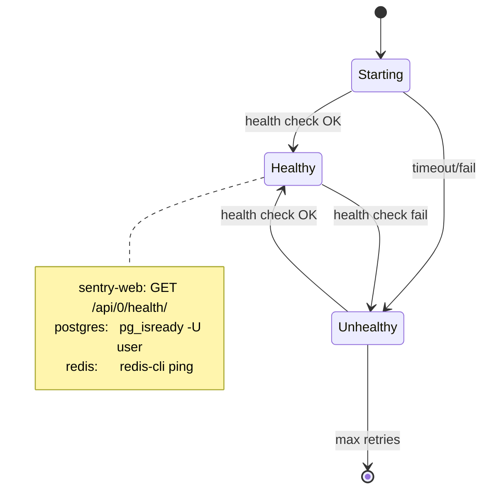

# Архитектура Sentry

## Архитектура компонентов

Sentry состоит из пяти сервисов:

- sentry-web — пользовательский интерфейс и API (порт 9000)
- sentry-worker — обработка очереди событий
- sentry-cron — выполнение периодических задач
- postgres — хранение метаданных и событий
- redis — реализация очередей и кэширование

Сеть platform_network используется только для маршрутизации через Caddy.

## Потоки данных

## Состав контейнеров

## Сетевая топология

## Volumes и персистентность

## Health Checks

**Ресурсы**: ~1.5–2 ГБ ОЗУ, ~5–10 ГБ дискового пространства
**Контейнеры**: 5 (sentry-web, sentry-worker, sentry-cron, postgres, redis)
**Сети**: platform_network (external), sentry_internal (internal)
**Volumes**: sentry-postgres, sentry-redis
